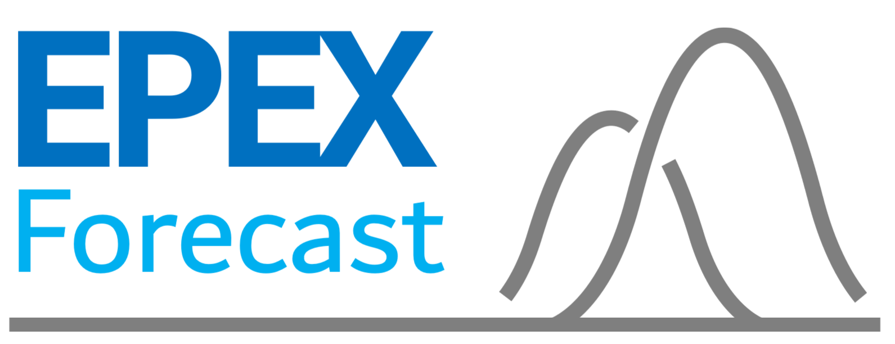
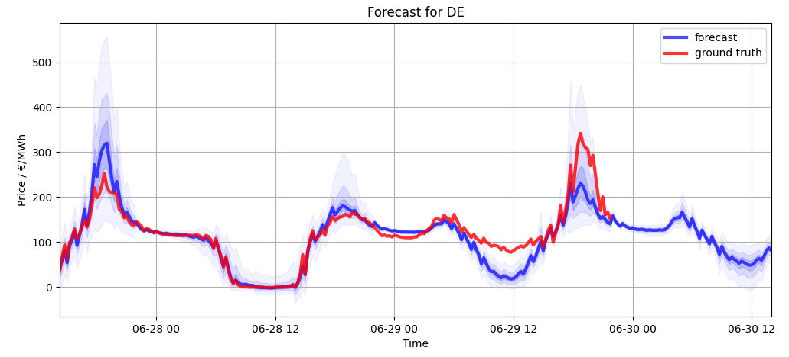

# EPEX Forecast (PyPi Access)


**Python package: Easy access to current market forecast**

[](https://pypi.org/project/epex_forecast/)
[](https://pypi.org/project/epex_forecast/)
[](https://opensource.org/licenses/MIT)

`epex_forecast` provides a minimal Python API to use the forecast API we provided through our research.

# Quick Start
## Installation

```bash
pip install epex_forecast
```

## Minimal Example
### Code
```python
from epex_forecast import get_epex_forecast, plot_forecast

forecast_df, meta = get_epex_forecast()
plot_forecast(forecast_df, meta)
```
### Output
#### meta
```python
{
    'region': 'DE', 
    'modelId': 'Chr2-prob-7step-[96]'
}
```
#### forecast_df
````csv
                           ground truth           0           1           2           3           4           5           6
2026-06-27 14:30:00+00:00         66.07    7.489024   33.999275   48.606190   59.912212   70.832802   86.320732  116.122849
2026-06-27 14:45:00+00:00         93.83   25.862049   54.465881   69.106926   80.855072   92.888962  110.560532  143.705048
2026-06-27 15:00:00+00:00         61.97    9.305321   34.496605   45.747437   54.106632   62.524593   74.426704  100.204086
2026-06-27 15:15:00+00:00         98.97   45.468853   73.135429   84.800629   92.647545  100.054573  110.290382  133.064301
2026-06-27 15:30:00+00:00        112.08   57.638866   86.084541   98.290726  106.322433  113.863327  125.216148  150.170151
2026-06-27 15:45:00+00:00        129.40   68.099258  100.683945  114.830284  124.534019  134.235596  148.514236  179.282013
...
````
#### plot_forecast


## License
Author: LSB (Fraunhofer IPA)

Licence pip package: MIT
